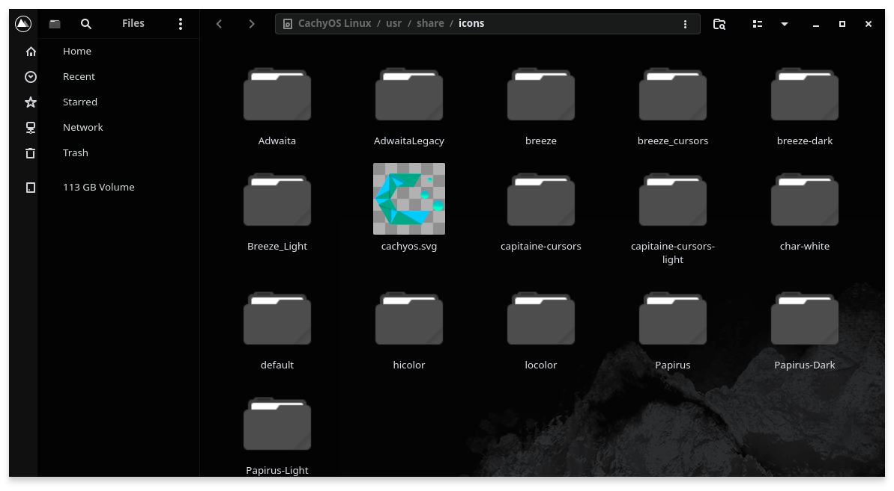

# Qogir AMOLED

A pure black (AMOLED) edition of the [Qogir](https://github.com/vinceliuice/Qogir-theme) theme for **KDE Plasma 6**, with matching GTK 2/3/4 and libadwaita themes.

It continues [ncarvalho99/qogir-black](https://github.com/ncarvalho99/qogir-black) and [ncarvalho99/Qogir-theme](https://github.com/ncarvalho99/Qogir-theme) (2022–2023), which turned Qogir's GTK theme black but predate Plasma 6 and never covered the KDE side.





## What's included

| Part | Name | Notes |
|---|---|---|
| Global theme | Qogir AMOLED | Sets everything below in one click. Leaves your panels alone. |
| Color scheme | Qogir AMOLED | Window `#030303`, views `#070707`, black titlebars. |
| Plasma style | Qogir AMOLED | Panel, popups and widgets follow the color scheme. |
| Window decorations | Qogir AMOLED, Qogir AMOLED (circle) | Aurorae, Plasma 6 metadata included. |
| Application style | Kvantum `Qogir-amoled` | Opaque black. `Qogir-amoled-translucent` keeps upstream's blur. |
| GTK theme | `Qogir-Amoled-Dark` | GTK 2, 3, 4 and libadwaita apps. Includes Qogir's Nautilus look (see below). |
| Icons and cursors | `Qogir-Dark` | Downloaded from upstream [Qogir-icon-theme](https://github.com/vinceliuice/Qogir-icon-theme). |
| Top panel | Qogir AMOLED Top Panel | Qogir's top bar: launcher, global menu, tray, split clock, search. Add it from *Add Panel*, or tick *Desktop and window layout* when applying the global theme (that replaces your panels). |
| Clock widget | Split Digital Clock | Plasma 6 rewrite of Qogir's date \| time clock, with the Plasma calendar in its popup. |
| Login screen | Qogir AMOLED | Plasma Login Manager or SDDM, with `--login`. |

## Install

Requirements: KDE Plasma 6, `git`, and Kvantum for the application style (on Arch/CachyOS: `sudo pacman -S --needed kvantum kvantum-qt5`).

```sh
git clone https://github.com/ncarvalho99/qogir-amoled
cd qogir-amoled
./install.sh --apply
```

Everything goes into your home directory; only `--login` needs root.

| Option | What it does |
|---|---|
| `--apply` | Switch the desktop to Qogir AMOLED (global theme, Kvantum, GTK, Flatpak override). |
| `--no-icons` | Don't download the Qogir icon/cursor theme. |
| `--login` | Also theme the login screen (asks for sudo). |
| `--uninstall` | Remove everything the installer added. With `--login`, also restores the previous login screen. |

Without `--apply`, pick it later in *System Settings → Colors & Themes → Global Theme → Qogir AMOLED*.

## The palette

The AMOLED palette is the same mapping the original black edits used, kept in [`tools/palette.tsv`](tools/palette.tsv):

| Qogir | AMOLED | Used for |
|---|---|---|
| `#282a33` | `#030303` | base, titlebar, entries |
| `#32343d` | `#070707` | window background |
| `#21232b` `#272931` | `#030303` | panel, sidebar |
| `#42444b` `#2b2e37` | `#151515` | raised surfaces |
| `#2c2f39` `#21232a` `#383a44` … | `#090909`–`#121215` | hover and pressed states |

Accent colors, text and borders are left untouched.

## Differences from upstream Qogir-kde

- Plasma 6 metadata (`metadata.json` with `KPackageStructure`) for the Plasma style and window decorations, so they show up in System Settings.
- Fixed Plasma SVGs that shipped a second stylesheet with hard-coded Breeze light colors, which made popups (e.g. the app launcher) render light grey on dark themes.
- The Kvantum style is opaque by default; translucency turned the black into grey.
- The desktop layout is a Plasma 6 script that loads the top panel template; upstream's serialized layout and its Plasma 5 wallpaper path are gone. The panel is also available on its own from *Add Panel*.
- The split clock was rewritten for Plasma 6 (upstream's is Plasma 5 only). Multiple time zones were dropped; use Plasma's Digital Clock for those.
- GTK 4 / libadwaita theming imports the theme from `~/.config/gtk-4.0/gtk.css` instead of symlinking over the file Plasma manages.

## Nautilus

Qogir's signature file manager look (the dark icon strip down the sidebar, the blue square and dot on the selected place, the mountain logo, the mountains in the corner of the view) was written for Nautilus' old sidebar and stopped applying when Nautilus rebuilt it as a plain list. [`gtk-amoled/_nautilus.scss`](gtk-amoled/_nautilus.scss) restores it for Nautilus 48+, and the corner mountains get an AMOLED version with a transparent background (upstream's dark one is an opaque `#282a33` block).

Dolphin can't be styled this way: Qt styles like Kvantum have no hook for a sidebar icon column or a view background image.

## Login screen

Plasma 6 distributions increasingly ship **Plasma Login Manager** instead of SDDM. It has no themes of its own: the greeter runs as the `plasmalogin` user and uses that user's color scheme, Plasma style, icons and cursor, plus a wallpaper set in `/etc/plasmalogin.conf`. `--login` installs those pieces to `/usr/local/share`, points the greeter at them, and keeps a backup in `/var/lib/qogir-amoled/login-backup` for `--uninstall --login`.

On SDDM systems `--login` installs Qogir's SDDM theme (Qt 6) as `Qogir-amoled` and selects it in `/etc/sddm.conf.d/qogir-amoled.conf`. The SDDM path has not been tested on real hardware yet.

Not ported: upstream's `win7showdesktop` plasmoid (Plasma 5 only; Plasma 6 ships *Peek at Desktop*).

## Rebuilding from upstream

`gtk/` and `kde/` are generated from upstream and committed so installing doesn't need any build tools. To update them:

```sh
git clone --depth 1 https://github.com/vinceliuice/Qogir-theme /tmp/Qogir-theme
git clone --depth 1 https://github.com/vinceliuice/Qogir-kde /tmp/Qogir-kde

tools/build-gtk.sh /tmp/Qogir-theme   # needs sassc
tools/build-kde.sh /tmp/Qogir-kde
```

The upstream commits currently used are in `gtk/UPSTREAM_COMMIT` and `kde/UPSTREAM_COMMIT`. Hand-written parts live outside those folders: `gtk-amoled/` (Nautilus sidebar and assets), `plasma/` (clock, panel template, desktop layout) and `login/`.

## Credits and license

Qogir is by [Vince Liuice](https://github.com/vinceliuice). This project is GPL-3.0, like upstream; see [LICENSE](LICENSE).

---

### Português

Edição preta total (AMOLED) do tema Qogir para o **KDE Plasma 6**, com os temas GTK 2/3/4 e libadwaita combinando. Continua os repositórios `qogir-black` e `Qogir-theme` de 2022–2023, que deixavam o Qogir GTK preto mas eram anteriores ao Plasma 6 e não tinham a parte do KDE.

Para instalar: `./install.sh --apply`. Para incluir a tela de login: `./install.sh --apply --login` (pede sudo). Para remover: `./install.sh --uninstall` (com `--login`, restaura a tela de login anterior).
