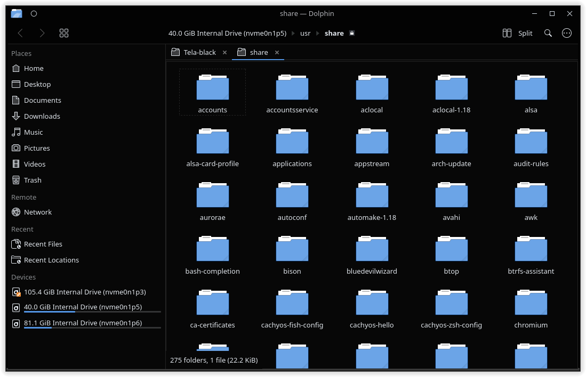
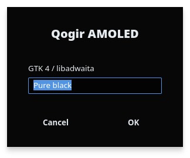

# Qogir AMOLED

A pure black (AMOLED) edition of the [Qogir](https://github.com/vinceliuice/Qogir-theme) theme for **KDE Plasma 6**, with matching GTK 2/3/4 and libadwaita themes.

It continues [ncarvalho99/qogir-black](https://github.com/ncarvalho99/qogir-black) and [ncarvalho99/Qogir-theme](https://github.com/ncarvalho99/Qogir-theme) (2022–2023), which turned Qogir's GTK theme black but predate Plasma 6 and never covered the KDE side.




## What's included

| Part | Name | Notes |
|---|---|---|
| Global theme | Qogir AMOLED | Sets everything below in one click. Leaves your panels alone. |
| Color scheme | Qogir AMOLED | Window `#030303`, views `#070707`, black titlebars. |
| Plasma style | Qogir AMOLED | Panel, popups and widgets follow the color scheme. |
| Window decorations | Qogir AMOLED, Qogir AMOLED (circle) | Aurorae, Plasma 6 metadata included. |
| Application style | Kvantum `Qogir-amoled` | Opaque black. `Qogir-amoled-translucent` keeps upstream's blur. |
| GTK theme | `Qogir-Amoled-Dark` | GTK 2, 3, 4 and libadwaita apps. |
| Icons and cursors | `Qogir-Dark` | Downloaded from upstream [Qogir-icon-theme](https://github.com/vinceliuice/Qogir-icon-theme). |

## Install

Requirements: KDE Plasma 6, `git`, and Kvantum for the application style (on Arch/CachyOS: `sudo pacman -S --needed kvantum kvantum-qt5`).

```sh
git clone https://github.com/ncarvalho99/qogir-amoled
cd qogir-amoled
./install.sh --apply
```

Everything goes into your home directory; no root needed.

| Option | What it does |
|---|---|
| `--apply` | Switch the desktop to Qogir AMOLED (global theme, Kvantum, GTK, Flatpak override). |
| `--no-icons` | Don't download the Qogir icon/cursor theme. |
| `--uninstall` | Remove everything the installer added. |

Without `--apply`, pick it later in *System Settings → Colors & Themes → Global Theme → Qogir AMOLED*.

## The palette

The AMOLED palette is the same mapping the original black edits used, kept in [`tools/palette.tsv`](tools/palette.tsv):

| Qogir | AMOLED | Used for |
|---|---|---|
| `#282a33` | `#030303` | base, titlebar, entries |
| `#32343d` | `#070707` | window background |
| `#21232b` `#272931` | `#030303` | panel, sidebar |
| `#42444b` `#2b2e37` | `#151515` | raised surfaces |
| `#2c2f39` `#21232a` `#383a44` … | `#090909`–`#121215` | hover and pressed states |

Accent colors, text and borders are left untouched.

## Differences from upstream Qogir-kde

- Plasma 6 metadata (`metadata.json` with `KPackageStructure`) for the Plasma style and window decorations, so they show up in System Settings.
- Fixed Plasma SVGs that shipped a second stylesheet with hard-coded Breeze light colors, which made popups (e.g. the app launcher) render light grey on dark themes.
- The Kvantum style is opaque by default; translucency turned the black into grey.
- The global theme doesn't ship a panel layout, so applying it won't replace your panels.
- GTK 4 / libadwaita theming imports the theme from `~/.config/gtk-4.0/gtk.css` instead of symlinking over the file Plasma manages.

Not ported: the SDDM login theme (needs root and a Qt 6 port) and the Plasma 5-only plasmoids.

## Rebuilding from upstream

`gtk/` and `kde/` are generated from upstream and committed so installing doesn't need any build tools. To update them:

```sh
git clone --depth 1 https://github.com/vinceliuice/Qogir-theme /tmp/Qogir-theme
git clone --depth 1 https://github.com/vinceliuice/Qogir-kde /tmp/Qogir-kde

# GTK: copy upstream, recolor the SASS palette, regenerate the CSS (needs sassc)
rsync -a --delete --exclude .git --exclude release /tmp/Qogir-theme/ gtk/
tools/amoledify.py gtk/src/_sass/_colors.scss gtk/src/gtk-2.0/theme*/gtkrc-Dark
(cd gtk && ./parse-sass.sh && rm -f src/_sass/_tweaks-temp.scss)
git -C /tmp/Qogir-theme rev-parse HEAD > gtk/UPSTREAM_COMMIT

# KDE
tools/build-kde.sh /tmp/Qogir-kde
```

The upstream commits currently used are in `gtk/UPSTREAM_COMMIT` and `kde/UPSTREAM_COMMIT`.

## Credits and license

Qogir is by [Vince Liuice](https://github.com/vinceliuice). This project is GPL-3.0, like upstream; see [LICENSE](LICENSE).

---

### Português

Edição preta total (AMOLED) do tema Qogir para o **KDE Plasma 6**, com os temas GTK 2/3/4 e libadwaita combinando. Continua os repositórios `qogir-black` e `Qogir-theme` de 2022–2023, que deixavam o Qogir GTK preto mas eram anteriores ao Plasma 6 e não tinham a parte do KDE.

Para instalar: `./install.sh --apply`. Não precisa de root. Para remover: `./install.sh --uninstall`.
